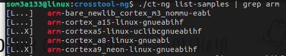
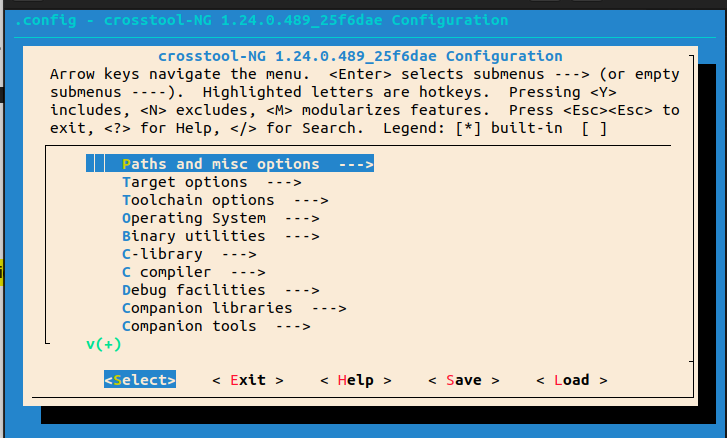
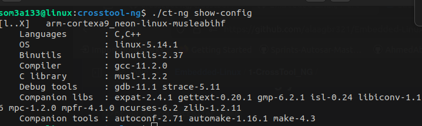
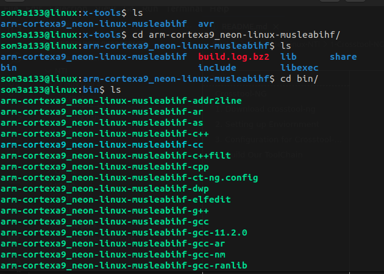

# Crosstool-NG

Crosstool-ng is an open-source tool designed to simplify and automate the process of building cross-compilation toolchains. Cross-compilation  toolchains are essential for developing software that runs on a different architecture or platform than the one on which it is compiled. This is common in embedded systems development, where software is often compiled on a host machine but executed on a target device with different hardware architecture.

# 1. Download crosstool-ng

```
git clone https://github.com/crosstool-ng/crosstool-ng.git
git checkout 25f6dae8
cd crosstool-ng/
```

# 2. Setting up Enviornment

Need to download the following dependencies

```shell
sudo apt-get install -y gcc g++ gperf bison flex texinfo help2man make libncurses5-dev \
python3-dev autoconf automake libtool libtool-bin gawk wget bzip2 xz-utils unzip \
patch libstdc++6 rsync
```

```
./bootstrap #Run bootstrap to setup all enviornment
```

```
./configure --enable-local #To check all dependency
```

```
make #To generate the Makefile for croostool-ng
```

# 3. Configuration for Crosstool-ng !

```
#To list all microcontrollers supported
./ct-ng list-samples
```



We will choose `arm-cortexa9_neon-linux-gnueabihf` as example:

```
#To configure the microcontroller used
./ct-ng arm-cortexa9_neon-linux-gnueabihf
```

```
#To configure our toolchain
./ct-ng menuconfig
```



**Our Needed Configurations :**

* [ ] C-library : **musl**
* [ ] C compiler : **support C++**
* [ ] Companion tools : **autoconf , automake, make**
* [ ] Debug facilities : **starce** , **gdb**

```
#Will show our configurations
./ct-ng show-config
```



# 4. Build Our ToolChain

```
#To build and get your toolchain
./ct-ng build
```

Wait till it finish and go check your tool chain

```
cd ~/x-tools
#If you have rootfs and wants to copy sysroot to it as it will be needed by your compiled apps if it is dynamicaly built
cp ~/x-tools/arm-cortexa9_neon-linux-musleabihf/arm-cortexa9_neon-linux-musleabihf/sysroot/* <path>/rootfs/
```

# 5. Result


