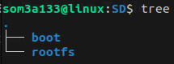
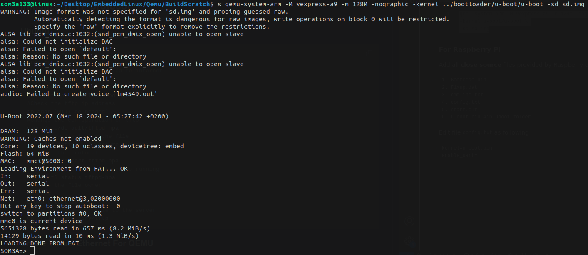

# U-boot

U-Boot, short for "Universal Bootloader," is an open-source bootloader commonly used in embedded systems and development boards. It provides a flexible and customizable boot environment for various architectures like ARM, MIPS, x86, and more. U-Boot is often used in conjunction with Linux-based operating systems but can boot other operating systems and firmware as well.

# 1. Download U-boot

```
git clone git@github.com:u-boot/u-boot.git
cd u-boot/
git checkout v2022.07

```

# 3. Configuration for u-boot !

List all supported boards  configuration by u-boot

```
ls configs/
```

## for Vexpress Cortexa9  Qemu

```
export CROSS_COMPILE=<Path To the Compiler>/arm-cortexa9_neon-linux-musleabihf-
export ARCH=arm
make qemu_arm_vexpress_defconfig
```

## for Raspberry pi 4 - 64

```
export CROSS_COMPILE=<Path To the Compiler>/aarch64-linux-gnu-
export ARCH=arm64

# depends what raspberry pi in used
make rpi_4_b_defconfig
```

**In the configuration, configure the following  requirement :**

```
make menuconfig
```

* [ ] Support  **editenv** .
* [ ] Support  **bootd** .
* [ ] Store the environment variable inside file call  **uboot.env** .
* [ ] Unset support of **Flash**
* [ ] Support **FAT file system**
  * [ ] Configure the FAT interface to **mmc**
  * [ ] Configure the partition where the fat is store to **0:1**

**configuration for bootcmd: it's the variable that run at start of uboot**

here we can load kernel and dtb from tftp or from FAT partition in SD card

#in case of vexpress we load its kernel image and dtb as example

**bootcmd at menuconfig: we will explain that later here**

```shell
setenv serverip 10.204.25.178;setenv ipaddr 10.204.25.176;setenv LOAD_FAT \"fatload mmc 0:1 $kernel_addr_r zImage;fatload mmc 0:1 $fdt_addr_r vexpress-v2p-ca9.dtb\";setenv LOAD_TFTP \"tftp $kernel_addr_r zImage; tftp $fdt_addr_r vexpress-v2p-ca9.dtb\";setenv Imagefat \"if run LOAD_FAT ; then echo \"LOADING DONE FROM FAT\"; else run LOAD_TFTP; echo \"LOADING DONE FROM TFTP\"; fi\";setenv bootcmd \"if mmc dev; then run Imagefat ; else run LOAD_TFTP; echo \"LOADING DONE FROM TFTP!\"; fi\";setenv bootargs \"console=ttyAMA0,115200n8 root=/dev/mmcblk0p2 rootfstype=ext4 rw rootwait init=/sbin/init\";setenv startk \"bootz $kernel_addr_r - $fdt_addr_r\";run bootcmd;
  
```

**We can add at end:` run startk` to start kernel after uboot automaticaly**

U-boot environemnt varibales are loaded and saved in boot/  FAT partition

# 4. Build SD card

**For Qemu [VIRTUAL SD]**

Make a new directory for our SD

```
mkdir virualSD && cd virtualSD
dd if=/dev/zero of=sd.img bs=1M count=1024
```

**For Physical SD**

name of SD device can be found by `lsblk`

```
export DISK=/dev/<sd-blk>
### WARNING Formating SD ###
sudo dd if=/dev/zero of=/dev/<sd-blk> bs=1M

```

**Configure the Partition Table for the SD card**

```
# for the VIRTUAL SD card
cfdisk sd.img

# for Physical SD card
cfdisk /dev/<sd-blk>
```

type DOS

| Partition Size | Partition Format |     Bootable     |
| :------------: | :---------------: | :---------------: |
|   `200 MB`   | `FAT 16 or 32 ` | ***Yes*** |
|   `700 MB`   |     `Linux`     | ***No*** |

### Loop Driver FOR Virtual usage ONLY

To emulate the sd.img file as a sd card we need to attach it to **loop driver** to be as a **block storage**

```shell
# attach the sd.img to be treated as block storage
sudo losetup -f --show --partscan sd.img
```

### Format Partition Table

first partition is **FAT**

```shell
# Formating the first partition as FAT
sudo mkfs.vfat -F 16 -n boot ${DISK}p1
  
```

second partition is linux

```shell
# format the created partition by ext4
sudo mkfs.ext4 -L rootfs ${DISK}p2
```

**Mounting For Virtual SD** :  mount boot partition in a directory  SD/boot after mounting any files in this location will be added to SD boot partition



```
sudo mount /dev/loop<>p1 SD/boot  # Copy uboot to it & files like kernel & dtb <will know more about them later in kernel section>
```

# 5. Load u-boot

##### For Vexpress-a9 (QEMU):

Start Qemu with the **virtual sd card**

```shell
qemu-system-arm -M vexpress-a9 -m 128M -nographic \
-kernel u-boot/u-boot \
-sd sd.img
```

##### For Raspberry Pi

Add all **close source** files provided by Raspberry depends  on each version to the **SD card in FAT Partition**

```
1. Bootcode.bin 
2. Fixup.dat
3. cmdline.txt
4. config.txt
5. start.elf
6. u-boot.bin #in uboot folder
```

Edit file `config.txt` as following

```
kernel=u-boot.bin
enable_uart=1
```

# 6. Load From FAT & TFTP

```
setenv LOAD_FAT "fatload mmc 0:1 $kernel_addr_r zImage;fatload mmc 0:1 $fdt_addr_r vexpress-v2p-ca9.dtb"

setenv LOAD_TFTP "tftp $kernel_addr_r zImage; tftp $fdt_addr_r vexpress-v2p-ca9.dtb"
```

FIrst variable LOAD_FAT loads kernel and dtb from FAT partition OF sdcard

Second variable LOAD_TFTP loads kernel & dtb from sever on Host machine

Note :

```
# this commend will show all the board information and it start ram address
bdinfo
```

**Start Qemu to test laoding from FAT**

```
qemu-system-arm -M vexpress-a9 -m 128M -nographic \
-kernel u-boot/u-boot \
-sd sd.img
```



# 7. Setup TFTP

To load data from Server to uboot we will use TFTP

```
sudo apt-get install tftpd-hpa
vim /etc/default/tftpd-hpa
tftf_option = “--secure –-create”

systemctl restart tftpd-hpa
cd /srv
chown tftp:tftp tftp
cp zImage board.dtp /srv/tftp
```

**Usage in U-boot  [serverip for host machine , ipaddr for target machine]**

```
setenv serverip 10.204.25.178
setenv ipaddr 10.204.25.176
```

And Then run LOAD_TFTP varibale to test it.

**Note they are configured in bootcmd  . look at first of readme]**

# 8. Create Virtual Ethernet For QEMU

interface between Qemu and Host using virtual ethernet  [tap0 and eth0]

Create a script `qemu-ifup`

```shell
#!/bin/sh
ip a add 10.204.25.178/24 dev $1
ip link set $1 up
  
```

**Start Qemu to test laoding from TFTP server**

```shell
sudo qemu-system-arm -M vexpress-a9 -m 128M -nographic \
-kernel u-boot/u-boot \
-sd sd.img \
-net tap,script=./qemu-ifup -net nic
```


