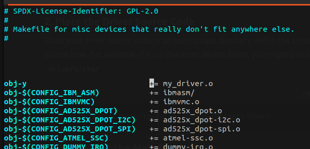
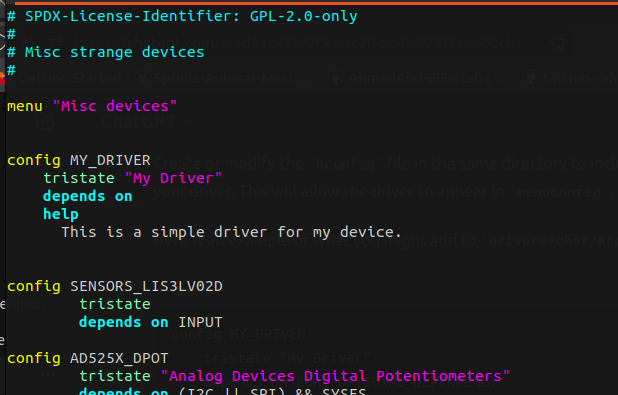
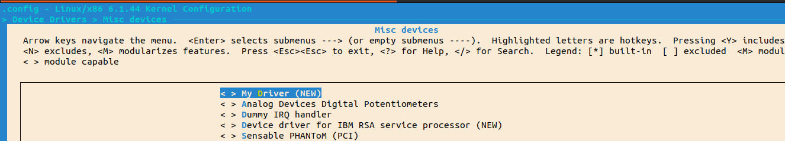

# Adding New Device Driver to Kernel Menuconfig

### 1-Place the Driver Source Code in Linux drivers

```
cp my_driver.c /path/to/linux/drivers/misc/

```

### 2. Edit the Makefile

Edit the `Makefile` in the directory where you placed your driver to include your driver’s source file.

Add the following line to `drivers/misc/Makefile`:

```
obj-y += my_driver.o

```



### 3. Edit the Kconfig File

Create or modify the `Kconfig` file in the same directory to include an entry for your driver. This will allow the driver to appear in `menuconfig`.

Here is an example of what you might add to `drivers/misc/Kconfig`:

```
config MY_DRIVER
    tristate "My Driver"
    depends on SOME_OPTIONAL_DEPENDENCY
    help
      This is a simple driver for my device.

```




### 4. Run menuconfig

Navigate to the root of your kernel source directory and run `menuconfig`:

```
make menuconfig
```

### 5. Results :


