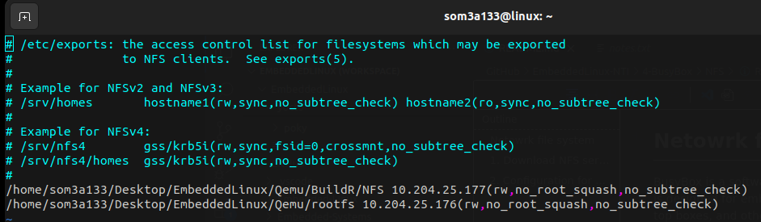
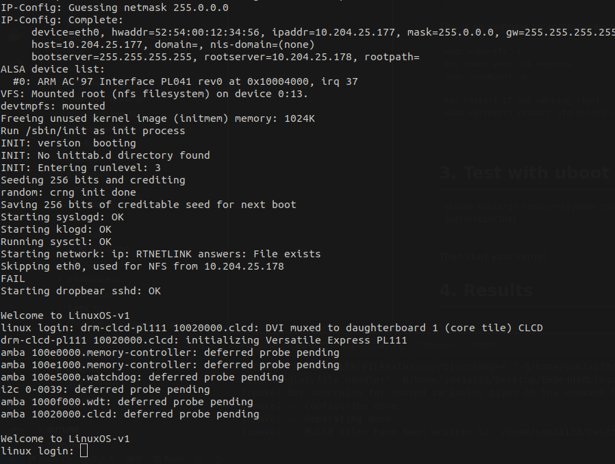
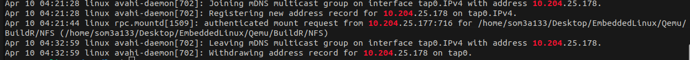

# Netowrk file system

A Network File System (NFS) is a distributed file system protocol allowing a user on a client computer to access files over a network as if the files were stored locally. NFS enables multiple users or client machines to access files concurrently and transparently across a network.

# 1. Download  NFS server

```
sudo apt install nfs-kernel-server

```

# 2. Configuration for NFS !

```
sudo vim /etc/exports
#add this to exports file

/<PATH>/rootfs <TARGET IP>(rw,no_root_squash,no_subtree_check)

```

This is an example for rootfs localy on host machine  and target ip sets to 10.204.25.177



* Mounts an NFS file system from a server with a specific IP address
* Mount point is specified as `/<PATH>/rootfs` on the local system
* Allows read and write access (`rw`)
* Grants root access to the client (`no_root_squash`)
* Disables subtree checking for better performance (`no_subtree_check`)

```
sudo exportfs -r
#to check your nfs exports
sudo showmount -e 

#do restart if not working right
sudo systemctl restart nfs-kernel-server


```

# 3. Test with uboot

```
setenv bootargs console=ttyAMA0 root=/dev/nfs ip=10.204.25.177:::::eth0 nfsroot=10.204.25.178:/home/som3a133/Desktop/EmbeddedLinux/Qemu/BuildR/NFS,nfsvers=3,tcp rw init=/sbin/init

```

**Then start your kernel**

# 4. Results



# 5. Errors ? no problem !

**Try troubleshooting with nfs service and it logs**

```
systemctl status nfs-server-kernel
systemctl restart nfs-server-kernel

# check system logs

cat /etc/var/log/syslog | grep NFS
#check for any request happens from uboot
cat /etc/var/log/syslog | grep <IP>

```


