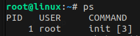
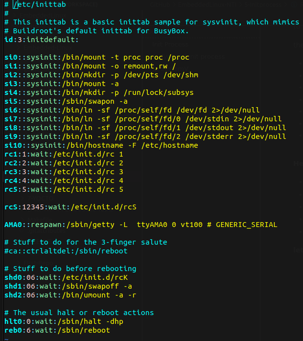
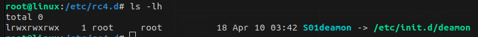
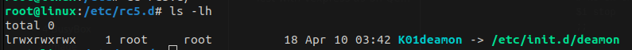
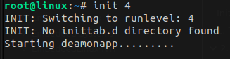
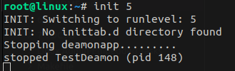
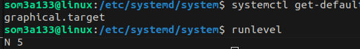
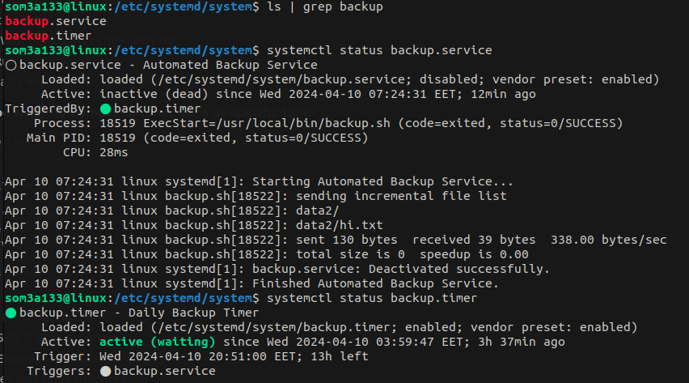

# Init Process

The "init" process, short for initialization, is the first process started during the booting of a computer system. It's the ancestor of all other processes and has a process ID (PID) of 1. The init process is responsible for initializing the system after the kernel has been loaded and managing the startup and shutdown processes.

# Types of init process

* **BusyBox init** : Simplified init system often used in embedded systems and lightweight distributions.
* **SysV init** : Traditional init system for Unix and Unix-like systems, based on runlevels and scripts.
* **systemd** : Modern init system for Linux, focused on speed, parallelization, and dependency management via unit files.

# 1. SystemV init

In busybox topic we knew about the order of busybox init and how it was simple and light weight process, now we will talk about SysV init .

System V init has two advantages:

* The boot scripts are written in a well-known formal make it easier to add more packages or bin to run at boot time.
* It has the concept of runlevels.

A runlevel is a numerical or alphanumeric identifier that represents a particular system state. In traditional SysV init systems, runlevels are usually denoted by numbers (0 through 6), with each number corresponding to a specific configuration.    `id:runlevel:action:process`

there are some common runlevels found across many distributions:

* **0** : Halt the system (shutdown).
* **1** : Single-user mode, used for system maintenance and repair.
* **2** : Multi-user mode without networking.
* **3** : Multi-user mode with networking (text-based interface).
* **4** : Undefined (often not used).
* **5** : Multi-user mode with networking and graphical user interface (GUI).
* **6** : Reboot the system.

**Here is the map :**

* **Boot-up** : The kernel loads `/bin/init` into memory and executes it as the first process during system boot-up.
* **Initialization** : Init initializes the system and starts parsing `/etc/inittab`.
* **Parsing `/etc/inittab`** : Init reads and interprets each line of `/etc/inittab` to understand the system's configuration.
* **Runlevel Definitions** : `/etc/inittab` defines runlevels and specifies actions for transitioning between them.
* **Executing Actions** : Init executes the actions specified in `/etc/inittab`, such as starting services or configuring devices.

**lets check for inittab of rootfs Generated by buildRoot for vexpress board configured to use systemV as initprocess**

## Step 1 Add runlevels entries to inittab

System here default is 3 as there's no GUI

 



We add here some runlevel entries from 1 to 5 as the action is `wait`  as when system goes to this runlevel it will execute this script.

```
cd /etc
sudo vim inittab
```

```
rc1:1:wait:/etc/init.d/rc 1
rc2:2:wait:/etc/init.d/rc 2
rc3:3:wait:/etc/init.d/rc 3
rc4:4:wait:/etc/init.d/rc 4
rc5:5:wait:/etc/init.d/rc 5

```

`rc1:1:wait:/etc/init.d/rc 1` means that when entering runlevel 1, execute `/etc/init.d/rc and give it arg {1}`

## Step 2 : Create rc script to <start|kill> deamon

All it do : it check for rc `<runlevel>`.d folder in `/etc/`  and if any scripts in it will be started|killed at specific runlevel which system go to .

**At target rootfs:**

```
cd /etc/init.d
sudo vim rc
chmod +x rc
```

**rc script:**

```
     #!/bin/bash

     # Check if one argument is provided
     if [ $# -ne 1 ]; then
         echo "Usage: $0 <runlevel>"
         exit 1
     fi

     # Define the folder path based on the argument
     folder="rc$1.d"

 
     # Start scripts starting with S
     for i in /etc/$folder/S??* ;do

          # Ignore dangling symlinks (if any).
          [ ! -f "$i" ] && continue

          case "$i" in
             *.sh)
                 # Source shell script for speed.
                 (
                     trap - INT QUIT TSTP
                     set start
                     . $i
                 )
                 ;;
             *)
                 # No sh extension, so fork subprocess.
                 $i start
                 ;;
         esac
     done
  
      # Kill scripts starting with K
     for i in /etc/$folder/K??* ;do

          # Ignore dangling symlinks (if any).
          [ ! -f "$i" ] && continue

          case "$i" in
             *.sh)
                 # Source shell script for speed.
                 (
                     trap - INT QUIT TSTP
                     set stop
                     . $i
                 )
                 ;;
             *)
                 # No sh extension, so fork subprocess.
                 $i stop
                 ;;
         esac
     done
```

## Step 3 : Create script to <start|stop> deamon

In target rootfs `/etc/init.d/ `create a script that {start|stop} deamon :  TestDeamon is an exe works on arm arch [check busybox/initApp section]

```
cd /etc/init.d
sudo vim deamon
chmod +x deamon
```

**deamon script**

```
#! /bin/sh
case "$1" in
      start)
           echo "Starting deamon"
           start-stop-daemon -S -n TestDeamon -a /bin/TestDeamon >/dev/null &
           ;;
     stop)
           echo "Stopping deamon"
           start-stop-daemon -K -n TestDeamon
           ;;
     *)
           echo "Usage: $0 {start|stop}"
           exit 1
esac
exit 0
```


## Step 4 : Create dirs for runlevels

```
cd /etc/
mkdir rc{1..5}.d
```


## Step 5 : link deamon to specific runlevel

link  deamon script  to specific runlevel folder  Using appropriate naming conventions (`S##` for start scripts, `K##` for kill/stop scripts).

```
ln -s /etc/init.d/deamon /etc/rc4.d/S01deamon #it will start the app when it goes to runlevel 4
```

```
ln -s /etc/init.d/deamon /etc/rc5.d/K01deamon #it will kill this app when it goes to runlevel 5
```

## Test on Vexpress a9 using Qemu !

Switch between `runlevel` using init `<runlevel>`





  

# 2. SystemD init

**Systemd** is a modern system and service manager for Linux , its advantages:

* It handles system startup, management of services, and resource control.
* Designed for faster boot times, efficient process management, and robust logging.

**Common Targets** :

* `multi-user.target`: Multi-user mode with networking.
* `graphical.target`: Graphical user interface (GUI) mode.

* `rescue.target`: Single-user mode for system recovery.

In **systemd**, instead of using `/etc/inittab`, you would define unit files for services, timers, and other systemd units. These unit files are typically stored in directories like `/etc/systemd/system/` or `/usr/lib/systemd/system/`.

Below is a table that maps SysV runlevels to systemd:

| SysV runlevel | SysD targets      |
| ------------- | ----------------- |
| 0             | poweroff.target   |
| 1             | rescure.target    |
| 2,3,4         | multi-user.target |
| 5             | graphical.target  |
| 6             | reboot.target     |

To check the current runlevel or target, you can still use the runlevel command as it was left intact for backward compatibility:

```
runlevel
```

So to check runlevel in systemd, we should use the systemctl command.

```
systemctl get-default
```



## Step 1 : Create script to be started by sysD unit file

Description : systemd service that automates the backup ofa specific directory to another location. The service should run daily at specific time and perform a full backup usingthe "rsync" command.

```
cd /usr/local/bin
sudo vim backup.sh
chmod +x backup.sh
```

```
#!/usr/bin/bash

SRC="/home/som3a133/data"
DEST="/home/som3a133/backup"

TIMESTAMP=$(date +%Y-%m-%d.%H.%M.%S.%N)
mkdir -p "$DEST/backup_$TIMESTAMP"

rsyncCONFIG="-avz --delete"
rsync $rsyncCONFIG "$SRC"/* "$DEST/backup_$TIMESTAMP"
#cp -r "$SRC"/* "$DEST/backup_$TIMESTAMP"

# list files from tail starts at +6 line 6 to skip the most 5 reccent folders

ls -dt "$DEST"/backup_* | tail -n +6 | xargs rm -rf
echo "$(date): Backup completed successfully" >> /var/log/backup.log

```

## Step 2 : Create SystemD unit file for our service

```
cd /etc/systemd/system
sudo vim backup.service
```

```
[Unit]
Description=Automated Backup Service
After=network.target

[Service]
Type=oneshot
Restart=on-failure
RestartSec=5s
ExecStart=/usr/local/bin/backup.sh

[Install]
WantedBy=multi-user.target

```

* **`Description`** : Automated backup process
* **`After`** : Waits until the network is ready
* **`Type`** : [oneshot] Runs once and stops
* **`Restart`** : If it fails, try again
* **`RestartSec`** : Wait 5 seconds before retrying
* **`ExecStart`** : Run the backup script
* **`WantedBy`** : Starts when users can log in

**This unit will be triggred by backup timer once at specific time.**

## Step 3 : Create timer to trigger our service

```
sudo vim backup.timer
```

```
[Unit]
Description=Daily Backup Timer
[Timer]
OnCalendar=*-*-* 20:51:00
Persistent=true
Unit=backup.service
[Install]
WantedBy=timers.target

```

* `Description`: Daily backup timer.
* `OnCalendar`: Sets trigger schedule.
* `Persistent`: Ensures timer's persistence.
* `Unit`: Specifies unit to be triggered .
* `WantedBy`: Determines start relative to system states.

After creating these files, you would typically reload systemd to recognize the new unit files:

```
systemctl daemon-reload
```

```
#you can start, stop, enable, or disable these services using systemctl commands.

systemctl start backup.timer
systemctl status backup.timer
systemctl status backup.service
```

## Test on Ubuntu


